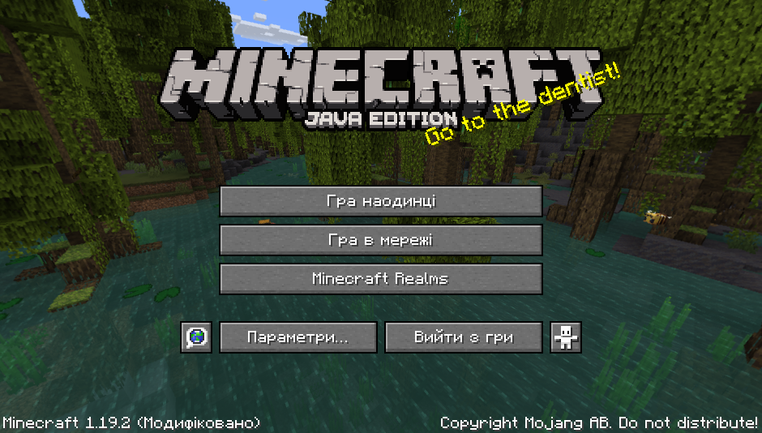
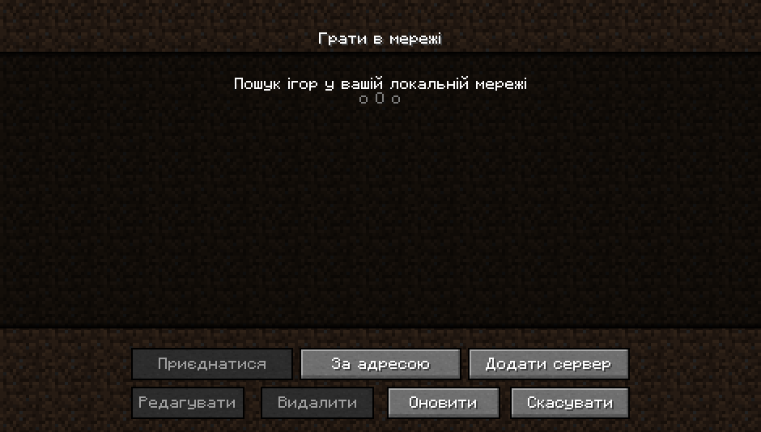
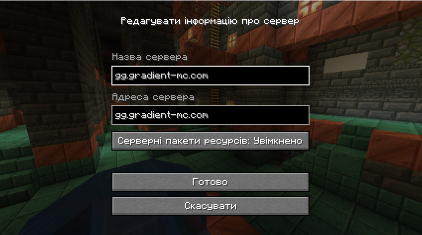

# 🚪 Як приєднатись до серверу?

gradient-mc - одна з невеличких мереж мінізабавок, що створена українським ентузіастом xLanyleeet'ом.

Щоб грати на сервері, ви повинні мати обліковий запис Minecraft для ПК/Mac/Linux (версія Java Edition) або ж піратський лаунчер.

> IP-адреса сервера gradient-mc: **gg.gradient-mc.com**


Будь-які інші версії Minecraft, такі як Windows 10, Pocket Edition або версії для консолі, не працюватимуть.


Як приєднатися до сервера?

Вам потрібно буде придбати обліковий запис Minecraft (якщо у вас його ще немає) і завантажити Minecraft, що можна зробити з [офіційного веб-сайту Minecraft](https://minecraft.net/). Інший спосіб, встановити піратський лаунчер по типу [UltimMC ](https://github.com/UltimMC/Launcher)або ж [SKlauncher](https://skmedix.pl/).

Після встановлення та готовності до гри ви можете приєднатися до серверу, додавши його до списку серверів у "Гра в мережі".

### Перейдіть до меню режиму для гри в мережі

<figure><figcaption>
Головне меню гри
</figcaption></figure>

### Додавання серверу

Щоб додати сервер до списку багатокористувацьких серверів, натисніть кнопку «Додати сервер» у нижній правій частині меню.

<figure><figcaption>
Гра в мережі
</figcaption></figure>

### Введення адреси серверу

<figure><figcaption>
Введеня назви та адреси серверу
</figcaption></figure>

### Приєднання до gradient-mc

Щоб приєднатися до сервера, клацніть сервер у списку серверів і натисніть кнопку "Приєднатися".

<figure><figcaption>
Список серверів
</figcaption></figure>
