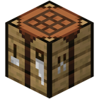

# 👑 Підписки

Підписка - річ, що дозволить функціонувати серверу далі, додаючи нові можливості та мінізабавки на сервер. Звісно, ніхто не примушує платити, але подумай сам(-а), скільки я вклав роботи та сил, створюючи сервер :)

Легенда | 1.99$/79₴ у місяць

* Нова привілея: \[Легенда]
* Можливість увімкнути швидкість &#x20;
* Можливість увімкнути стрибок  
* Можливість стакання до 5 гравців  
* Захід на заповнені арени БедВарс  
* Чат донатерів 
* Прохідка на сервер Виживання (за узгодженою попередньо заявкою) 

Сеньйор | 2.99$/119₴ у місяць

* Нова привілея: \[Сеньйор]
* Можливість увімкнути швидкість 2  
* Можливість увімкнути стрибок 2  
* Можливість увімкнути політ 
* Можливість стакання до 10 гравців  
* Захід на заповнені арени БедВарс  
* Запуск гри у БедВарс не чекаючи відліку 
* Чат донатерів 
* Прохідка на сервер Виживання (за узгодженою попередньо заявкою) 

## _**Посилання для придбання:**_

_**Легенда:**_


Посилання для купівлі Легенди.&#x20;


_**Сеньйор:**_


Посилання для купівлі Сеньйора.


## Як придбати?

1.  Обираємо потрібну підписку.

    <figure><figcaption>
Посилання для придбання
</figcaption></figure>
2.  Пишемо свій нікнейм у поле "Ваше Ім'я"

    <figure><figcaption>
Введення ігрового нікнейму
</figcaption></figure>
3.  Оплачуємо.

    <figure><figcaption>
Вікно оплати
</figcaption></figure>
4. Отримуємо привілеї!

